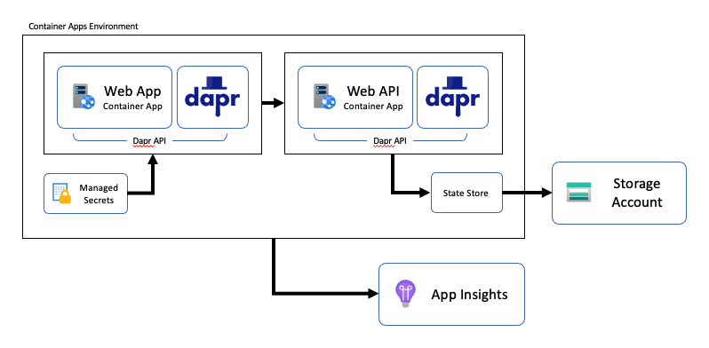

# Java on Azure Container Apps with Dapr sample
Dapr (Distributed Application Runtime) is a runtime that helps you build resilient stateless and stateful microservices. This repository includes a Java-based Dapr application which is deployed to Azure Container Apps via a Bicep template.



## Running locally:

1. Initialize Dapr:

    ```
    dapr init
    ```

1. Build the Java packages:

    ```
    ./mvnw clean package
    ```

1. Run the Web API:

    ```
    dapr run --components-path ./webapi/components --app-id webapi --app-port 3000 -- java -jar webapi/target/webapi-0.0.1-SNAPSHOT.jar --server.port=3000
    ```

1. Run the Web App:

    ```
    dapr run --app-id webapp --app-port 8080 -- java -jar webapp/target/webapp-0.0.1-SNAPSHOT.jar --server.port=8080
    ```

## Deploy to Azure Container Apps

1. [Create a private container registry using the Azure CLI](https://docs.microsoft.com/en-gb/Azure/container-registry/container-registry-get-started-azure-cli)

1. Build containers images:

    ```
    docker build -t <login-server>/java-app/webapi:v1 webapi
    docker build -t <login-server>/java-app/webapp:v1 webapp
    ```

1. Push container images to your Container Registry:

    ```
    docker push <login-server>/java-app/webapi:v1
    docker push <login-server>/java-app/webapp:v1
    ```

1. Set required environment variables:

    ```
    RESOURCE_GROUP="my-containerapps"
    LOCATION="eastus2"
    ```

1. Create a resource group:

    ```
    az group create \
        --name $RESOURCE_GROUP \
        --location "$LOCATION"
    ```

1. Deploy:

    ```
    az deployment group create \
    --resource-group "$RESOURCE_GROUP" \
    --template-file ./infra/main.bicep \
    --parameters \
        registry_server="<registry_server>" \
        registry_username="<registry_username>" \
        registry_password="<registry_password>"
    ```